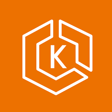
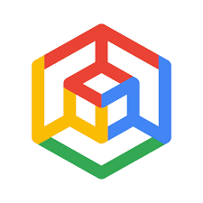
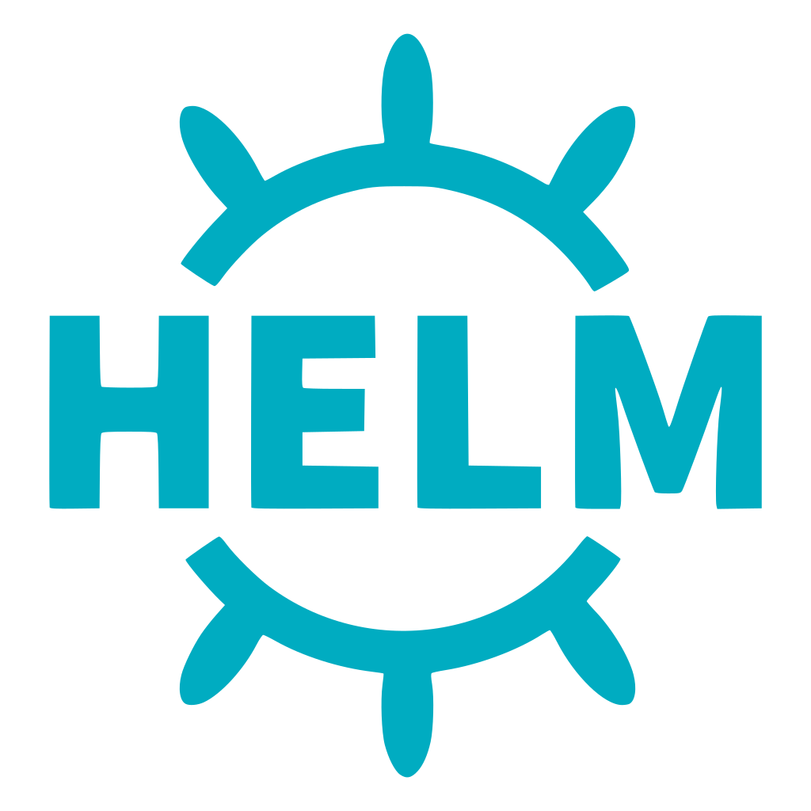
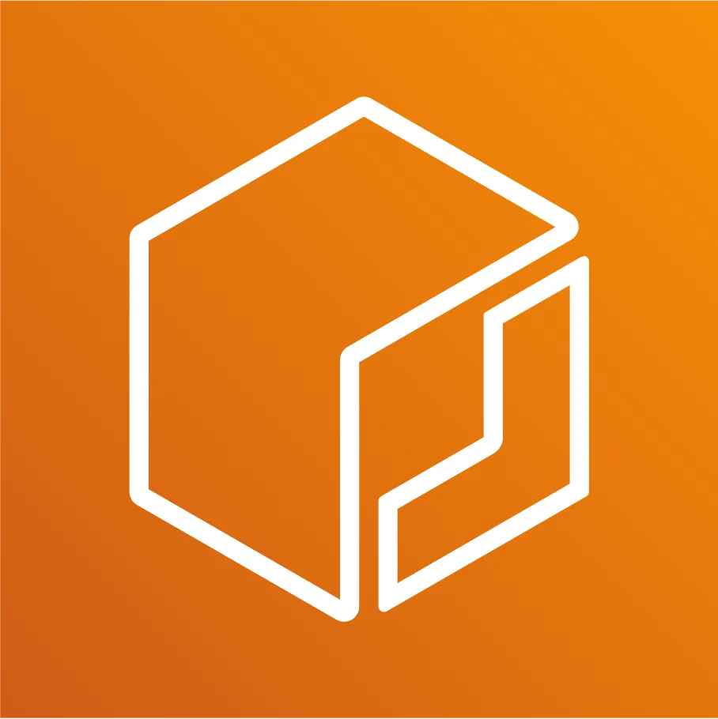

# 👋 Hi there, I'm Sidhartha Mandal ([@sidh4u](https://github.com/sidh4u))

**DevOps Architect | Platform Engineering Leader | Multi-Cloud & AI Infrastructure | FinOps | Observability**

---

### 🚀 About Me

I’m a **Technology Leader and Platform Engineering Strategist** with 20+ years of experience shaping **cloud-native, multi-cloud, and AI-ready platforms** across enterprises and startups.

My work brings together **DevOps, Platform Engineering, and AI Infrastructure**, helping organizations design **scalable, resilient, secure, and cost-optimized systems** that accelerate innovation.
Recently, I’ve been deeply focused on architecting **GPU-powered, multi-cloud environments** across **AWS, GCP, and Azure**, enabling large-scale **AI/ML workloads** and intelligent data pipelines.

I specialize in **Kubernetes (EKS, GKE, AKS)**, **Terraform**, **Helm**, **GitOps**, and **Grafana Stack–based observability**, while leveraging **automation, autoscaling**, and **FinOps strategies** to balance performance, security, and cost efficiency.

---

### 🧠 Experience Highlights

- **Current Engagement – Confidential AI Startup (Consulting)**
  Working with a venture-backed AI startup (stealth mode) to design and implement a **multi-cloud, GPU-enabled AI infrastructure platform**.
  Architected scalable Kubernetes clusters across **AWS (EKS)**, **GCP (GKE)**, and **Azure (AKS)** with **NVIDIA GPU Operator**, **GPU time-sharing**, and **autoscaling** for efficient AI/ML training workloads.
  Built the foundation for a **modular Infrastructure-as-Code** architecture using **Terraform** and **Helm**, integrating **Istio**, **Ray**, **Temporal**, and **AIBrix** to orchestrate complex AI workflows.
  Strengthened **security and observability** using **cloud-native Secret Managers**, **Vault**, and the **Grafana Stack (Mimir, Loki, Tempo, Alloy)** — providing unified monitoring and cost insights across clouds.

- **CaaStle** – Led **DevOps transformation** and the shift to a **microservices-based architecture** using EKS and Terraform.
  Modernized **CI/CD pipelines**, integrated **Okta SSO** and **IAM/RBAC** security controls, and established a centralized **observability platform** for end-to-end visibility and reliability.

- **Intuit** & **Nokia** – Architected large-scale **Big Data platforms**, building **data lakes, ETL pipelines, Spark clusters, Kafka streaming systems, and ingestion frameworks** across AWS and on-prem environments.
  Focused on **distributed data systems**, **automation**, and **performance optimization** for petabyte-scale processing.

- **Yahoo** & **AOL** – Managed critical infrastructure and scaled web services supporting millions of global users with **high availability**, **security**, and **cloud transition strategies**.

---

### 🌍 What I’m Focused On

- Building **multi-cloud & GPU-enabled AI infrastructure** for next-generation products.
- Designing **cost-efficient, secure, and automated cloud platforms** with **observability-first principles**.
- Enabling teams through **DevOps transformation**, **GitOps adoption**, and **FinOps culture**.
- Open to both **consulting engagements** and **full-time leadership roles** in **Platform Engineering and AI Infrastructure**.

---

## 🛠️ My Tech Toolkit Includes

  <!-- Multi Cloud and AI -->
  
  
  
  
  <!-- Containerization -->
  
  
  
   
  
  
  
  <!-- AWS Containerization -->
  
  
  
  <!-- Infra and Config Section -->
  
  
  <!-- Observability -->
  
  
  
  
  
  
  <!-- CI/CD -->
  
  
  
  <!-- Others -->
  
  
  
  <!-- Big Data -->
  
  
  
  <!-- Code -->
  
  
  

---

### ✨ Beyond Work

When I’m not building cloud platforms, I’m usually exploring **photography, art, or travel** — creative spaces that influence how I think about **design, systems, and innovation**.

---

### 🤝 Let’s Connect

- 💼 [LinkedIn](https://www.linkedin.com/in/sidh4u)
- 🌐 [Personal Website](https://sidh4u.github.io)
- ✉️ [Email Me](mailto:sidh4u@gmail.com)

---

_“Designing resilient systems that power intelligent innovation.”_
