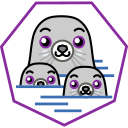
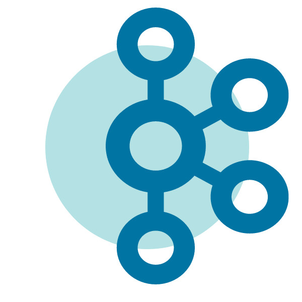

<h4 align="center"><em>Simplifying complexity, one scalable solution at a time.</em></h4>

I’m a DevOps Architect who’s been designing and securing infrastructure since the dial-up days—starting from bare metal, through virtualization, to containerization.

🚀 These days, I’m building scalable, resilient platforms at [Caastle](https://www.linkedin.com/company/caastle/?originalSubdomain=in)—driving automation, observability, and open-source ROI, while mentoring teams, setting best practices, and fostering an engineering culture that scales.

🏢 Previously worked at Intuit, Nokia, Yahoo, AOL, and a few startups—always blending scale with simplicity.

🛠️ My tech toolkit includes:

  <!-- Containerization -->
  
  
  
  
  <!-- AWS Containerization -->
  
  
  
  <!-- Infra and Config Section -->
  
  
  <!-- Observability -->
  
  
  
  
  
  
  <!-- CI/CD -->
  
  
  
  <!-- Others -->
  
  
  
  <!-- Big Data -->
  
  
  
 <!-- Code -->
  
  
  

- ✉️ You can DM me at [Linkedin](https://www.linkedin.com/in/sidh4u/)
- 🧠 I'm currently exploring [Karpenter](https://karpenter.sh/)
- 🤝 I'm open to collaborating on open source projects

✨ Outside the terminal: Photography 📸 | Exploring places ✈️ | Painting & Sketching 🎨

🌟 Let's connect and build the future together!
