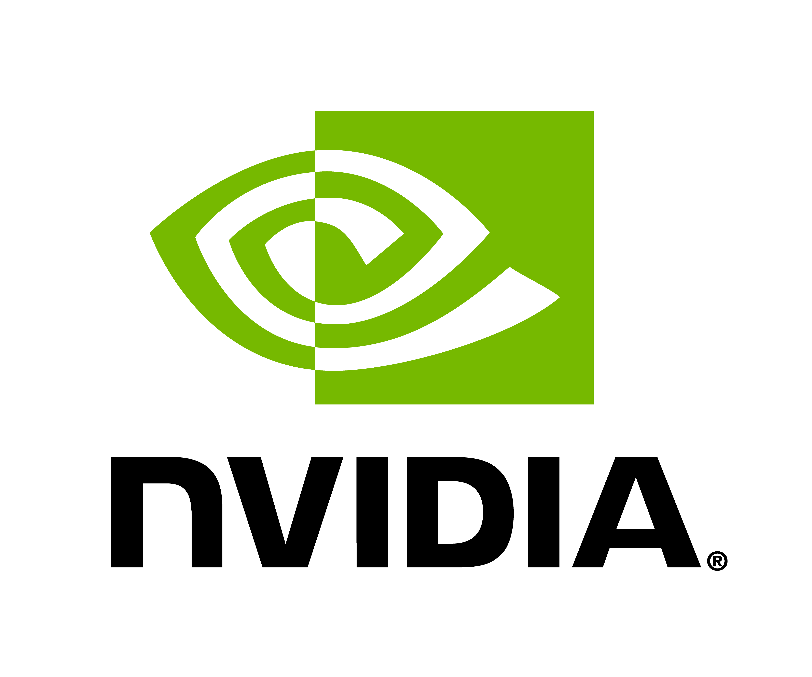
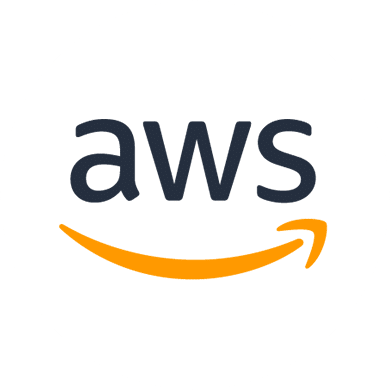
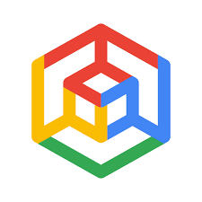
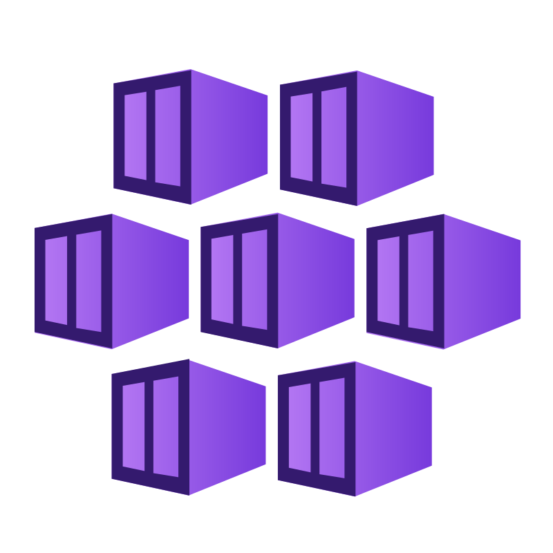
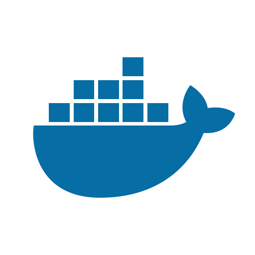
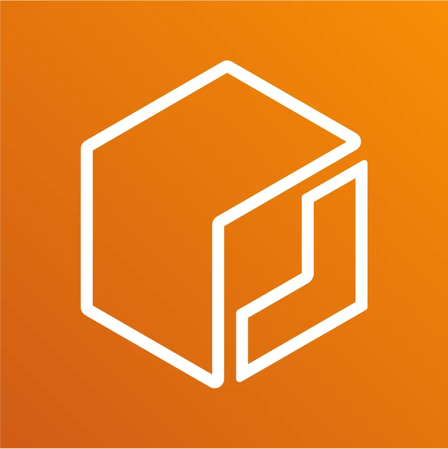
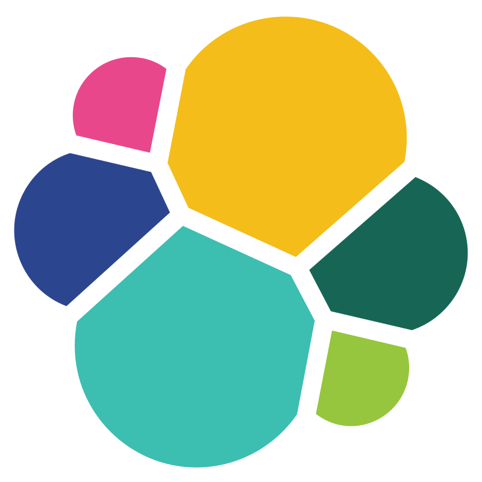
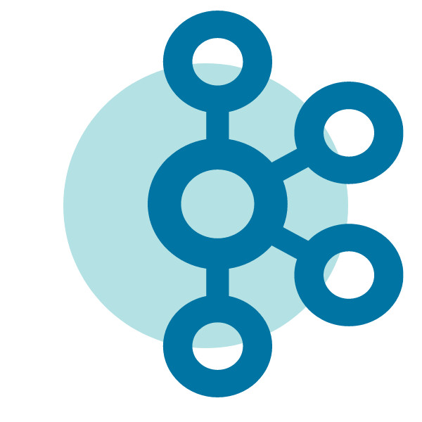

# 👋 Hi there, I'm Sidhartha Mandal ([@sidh4u](https://github.com/sidh4u))

**Cloud & Platform Architect | Co-founder @ SIPATECH | Multi-Cloud & AI Infrastructure | DevOps | FinOps | Observability**

---

### 🚀 About Me

I'm a **cloud and platform architect** and co-founder of [SIPATECH](https://sipatech.io) - with 20+ years of experience building **cloud-native, multi-cloud, and AI-ready platforms** across enterprises and startups.

My work brings together **DevOps, Platform Engineering, and AI Infrastructure**, helping organizations design **scalable, resilient, secure, and cost-optimized systems** that accelerate innovation.

Recently, I've been deeply focused on architecting **GPU-powered, multi-cloud AI infrastructure** - across two US-based AI startups:

- **Confidential AI Startup (Stealth Mode)** - Designed and built a production-grade, multi-cloud AI infrastructure platform across **GCP and Azure** - GPU-enabled Kubernetes clusters, unified IaC using **Terraform** and **Helm**, distributed AI pipelines using **Ray**, **Istio**, and **Temporal**, and a full cross-cloud observability stack. This engagement sparked the conviction to co-found SIPATECH.

- **Confidential AI Startup** - Designed and deployed an **Amazon Bedrock-based AI infrastructure** on AWS - spanning multiple **EKS clusters** with a centralised observability platform built on the **LGTM stack** ([Loki](https://grafana.com/oss/loki/), [Grafana](https://grafana.com/), [Tempo](https://grafana.com/oss/tempo/), [Mimir](https://grafana.com/oss/mimir/)) running in Kubernetes.

I specialize in **Kubernetes (EKS, GKE, AKS)**, **Terraform**, **Helm**, **GitOps**, and **Grafana Stack–based observability**, while leveraging **automation, autoscaling**, and **FinOps strategies** to balance performance, security, and cost efficiency.

---

### 🧠 Experience Highlights

- **Current – [SIPATECH](https://sipatech.io) (Co-founder)**
  Building a cloud and platform engineering consultancy focused on AI infrastructure for startups and enterprises.
  Working with teams to design and implement **multi-cloud, GPU-enabled AI infrastructure platforms** across **AWS (EKS)**, **GCP (GKE)**, and **Azure (AKS)**.

- **CaaStle** – Led **DevOps transformation** and the shift to a **microservices-based architecture** using EKS and Terraform.
  Modernized **CI/CD pipelines**, integrated **Okta SSO** and **IAM/RBAC** security controls, and established a centralized **observability platform** for end-to-end visibility and reliability.

- **Intuit** & **Nokia** – Architected large-scale **Big Data platforms**, building **data lakes, ETL pipelines, Spark clusters, Kafka streaming systems, and ingestion frameworks** across AWS and on-prem environments.
  Focused on **distributed data systems**, **automation**, and **performance optimization** for petabyte-scale processing.

- **Yahoo** & **AOL** – Managed critical infrastructure and scaled web services supporting millions of global users with **high availability**, **security**, and **cloud transition strategies**.

---

### 🌍 What I'm Focused On

- Building **multi-cloud & GPU-enabled AI infrastructure** for next-generation products.
- Designing **cost-efficient, secure, and automated cloud platforms** with **observability-first principles**.
- Enabling teams through **DevOps transformation**, **GitOps adoption**, and **FinOps culture**.
- Co-founding and growing **[SIPATECH](https://sipatech.io)** - cloud and platform engineering for startups and enterprises.

---

## 🛠️ My Tech Toolkit Includes

  <!-- Multi Cloud and AI -->
  
  
  
  
  <!-- Containerization -->
  
  
  
  
  
  
  <!-- AWS Containerization -->
  
  
  
  <!-- Infra and Config Section -->
  
  
  <!-- Observability -->
  
  
  
  
  
  
  <!-- CI/CD -->
  
  
  
  <!-- Others -->
  
  
  
  <!-- Big Data -->
  
  
  
  <!-- Code -->
  
  
  

---

### 🤝 Let's Connect

- 💼 [LinkedIn](https://www.linkedin.com/in/sidh4u)
- 🌐 [Personal Website](https://sidharthamandal.com)
- 📝 [TOPOLOGY on Substack](https://sidh4u.substack.com)
- 🏢 [SIPATECH](https://sipatech.io)

---

_"Designing resilient systems that power intelligent innovation."_
